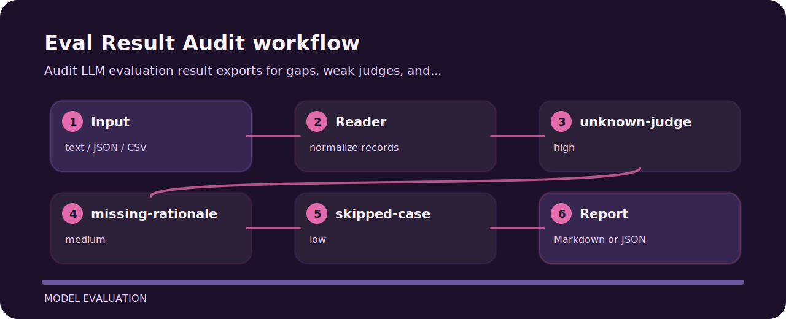

# Eval Result Audit


Audit LLM evaluation result exports for gaps, weak judges, and missing rationales.

## Before the fix

The sample fixture in `examples/` is the quickest way to see the check fire.

## Decision points

| Signal | Level | What it flags | Fix direction |
| --- | --- | --- | --- |
| `unknown-judge` | high | judge identity is missing | Record judge version, model, or rubric name. |
| `missing-rationale` | medium | judge rationale is missing | Store concise rationale for auditability. |
| `skipped-case` | low | eval case was skipped | Track skipped cases separately from passing cases. |

## Signal route



## Fresh clone path

```bash
git clone https://github.com/mertefekurt/eval-result-audit.git
cd eval-result-audit
python -m pip install -e ".[dev]"
eval-result-audit examples/sample.txt
```
