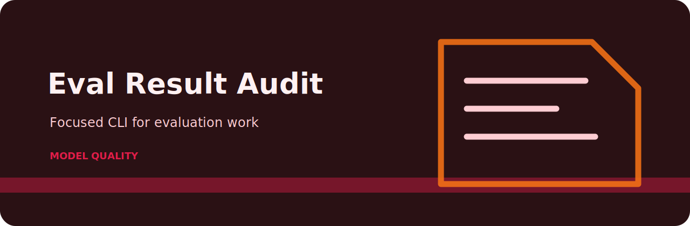

# Eval Result Audit



Audit LLM evaluation result exports for gaps, weak judges, and missing rationales.

## The rule file is the product

- `unknown-judge` (high): judge identity is missing. Fix: Record judge version, model, or rubric name..
- `missing-rationale` (medium): judge rationale is missing. Fix: Store concise rationale for auditability..
- `skipped-case` (low): eval case was skipped. Fix: Track skipped cases separately from passing cases..

Everything else in the repo exists to feed records into those checks and render the answer in a way a person can act on.

## Shell session

```bash
git clone https://github.com/mertefekurt/eval-result-audit.git
cd eval-result-audit
python -m venv .venv
source .venv/bin/activate
python -m pip install -e ".[dev]"
eval-result-audit examples/sample.txt
eval-result-audit examples/sample.txt --json
```

## Repository shape

```text
.github/        CI workflow
examples/       sample inputs
src/            package source
tests/          test coverage
.gitignore      project file
pyproject.toml  package metadata
```
